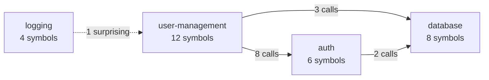

# ADR-026: Graphify-Style MCP Tools — Graph Query, Explain, Edge Queries

**Status:** Accepted  
**Date:** 2026-06-15  
**Source:** Gap analysis: Graphify capabilities not yet in CogniCode MCP

## Context

CogniCode MCP has 55+ tools today, covering build_graph, call hierarchy, impact
analysis, architecture detection, community detection, PageRank, dead code,
Mermaid export, and more. However, Graphify offers several capabilities that
CogniCode MCP lacks — most critically `graph_query` (natural language graph
topology query), which is Graphify's flagship feature for AI agents.

Additionally, the new edge types from the ingest pipeline (ADR-017/018) —
Imports, References, Inherits, Implements, Contains — enable query patterns
that no existing tool exposes.

This ADR specifies **10 new MCP tools** organized in three tiers.

## Decision

### Tier 1: Graph-Native Query Tools (Sprint 1-2)

#### 1. `graph_query` — Natural Language Graph Topology Query

The flagship Graphify feature. An AI agent asks a question in natural language;
the tool finds relevant nodes, traverses the graph, and returns a subgraph with
explanations.

```json
{
  "tool": "graph_query",
  "arguments": {
    "question": "what connects the auth middleware to the database?",
    "max_depth": 3,
    "budget": 1500,
    "edge_filter": ["calls", "references", "imports"]
  }
}
```

**Algorithm (deterministic, no LLM):**

```
1. QUERY PARSE
   - Tokenize question by whitespace + punctuation
   - Remove stop words (the, a, is, what, how, does, etc.)
   - Detect intent verbs: "connects"→all, "calls"→Calls, "depends"→Calls+References+Imports,
     "implements"→Implements, "inherits"→Inherits, "uses"→Calls+References
   - Extract remaining keywords: ["auth", "middleware", "database"]

2. NODE MATCHING (seed set)
   - For each keyword, run graph_search_idf to find top-N matching nodes
   - Score = IDF weight × label similarity
   - Collect seed nodes (dedup by ID, max 10 seeds)

3. SUBGRAPH EXPANSION
   - BFS from each seed node, up to max_depth hops
   - Follow only edges matching edge_filter (or intent verbs if filter omitted)
   - Budget guard: stop when total nodes collected ≥ budget
   - Track provenance per edge (Extracted > Inferred > Ambiguous)

4. RESULT
   - Nodes: [{id, label, kind, source_path, community, why_matched}]
   - Edges: [{source, target, relation, provenance, confidence, path_from_seed}]
   - Explanation: "auth_middleware matched 'auth middleware'. It calls
     validate_token → fetch_user → query_database which matched 'database'.
     Connection found via Calls edges with Extracted provenance."
```

**Why no LLM:** The AI agent calling this tool IS the LLM. The tool returns
structured graph data; the agent interprets it. Graphify works the same way —
its `query` command is a deterministic graph traversal, not an LLM call.

#### 2. `graph_explain` — Composite Deep-Dive on One Node

Returns everything about a node in one call. Saves the agent from making 5-6
separate calls (get_call_hierarchy, graph_community_detail, get_complexity,
find_dead_code, get_type_references, etc.).

```json
{
  "tool": "graph_explain",
  "arguments": {
    "symbol": "UserService::create_user",
    "depth": 2
  }
}
```

**Response shape:**

```json
{
  "node": {
    "id": "...", "label": "create_user", "kind": "symbol.function",
    "source_path": "src/services/user_service.rs", "line": 42,
    "complexity": { "cyclomatic": 8, "cognitive": 12 }
  },
  "callers": [{ "symbol": "AuthController::register", "depth": 1 }, ...],
  "callees": [{ "symbol": "UserRepository::save", "depth": 1 }, ...],
  "type_references": [{ "target": "User", "context": "param_type" }, ...],
  "community": { "id": 3, "label": "user-management", "cohesion": 0.82 },
  "surprising_connections": [{ "via": "Logger::audit", "community": "logging" }],
  "god_node": { "pagerank_percentile": 0.92, "is_god": true },
  "dead_code": false,
  "solid_hints": ["DIP: depends on concrete UserRepository, not a trait"]
}
```

Internally calls 6+ existing tools and aggregates. The aggregation is pure —
no new algorithms, just composition.

#### 3. `get_graph_report` — Pipeline Report Access

Already specified in ADR-025 (Mode B). Fetches the auto-generated GraphReport
from the pipeline's Report stage.

```json
{
  "tool": "get_graph_report",
  "arguments": {}
}
```

Returns from `graph_reports` table: god_nodes, communities, surprising
connections, dead_code, suggested_questions, metrics.

### Tier 2: Edge-Type Query Tools (Sprint 2)

These tools expose the new edge types from the LanguageConfig extractor. They
are trivial graph traversals filtered by edge kind.

#### 4. `get_type_references` — References Edges

```json
{
  "tool": "get_type_references",
  "arguments": { "symbol": "UserRepository::save" }
}
```

Returns all type annotation references for a function:
```json
{
  "param_types": ["User"],
  "return_type": "Result<User, Error>",
  "field_types": ["DbPool"],
  "generic_args": []
}
```

Enables SOLID DIP analysis: if all types are concrete structs (not traits),
the function violates Dependency Inversion.

#### 5. `get_imports` — Imports Edges

```json
{
  "tool": "get_imports",
  "arguments": { "file_path": "src/services/user_service.rs" }
}
```

Returns all modules imported by this file:
```json
{
  "imports": [
    { "target": "crate::models::user", "module": "models::user" },
    { "target": "crate::repos::user_repo", "module": "repos::user_repo" }
  ]
}
```

#### 6. `get_implementors` — Implements / Inherits Edges

```json
{
  "tool": "get_implementors",
  "arguments": { "trait_name": "UserRepository" }
}
```

Returns all types that implement or inherit from the given trait/class:
```json
{
  "implementors": [
    { "symbol": "PostgresUserRepository", "file": "src/infra/pg_user_repo.rs" },
    { "symbol": "MockUserRepository", "file": "src/mocks/mock_user_repo.rs" }
  ]
}
```

#### 7. `get_members` — Contains Edges (Class → Methods/Fields)

```json
{
  "tool": "get_members",
  "arguments": { "class_name": "UserController" }
}
```

Returns all methods and fields contained in a class/struct/impl block:
```json
{
  "methods": [
    { "name": "create", "line": 15, "complexity": 3 },
    { "name": "delete", "line": 32, "complexity": 2 }
  ],
  "fields": [
    { "name": "repo", "type": "Arc<dyn UserRepository>" }
  ]
}
```

#### 8. `get_iac_references` — Terraform/Ansible References

```json
{
  "tool": "get_iac_references",
  "arguments": { "resource_id": "tf:main.tf:aws_instance.web" }
}
```

Returns all resources that reference this Terraform/Ansible resource:
```json
{
  "references": [
    { "source": "tf:main.tf:aws_eip.web", "relation": "references" },
    { "source": "tf:main.tf:module.vpc", "relation": "references" }
  ]
}
```

### Tier 3: Enhanced Query + Export (Sprint 2-3)

#### 9. `graph_query_filtered` — Provenance/Kind/Community Filtered Query

Extends `graph_query` with filters that Graphify doesn't have:

```json
{
  "tool": "graph_query_filtered",
  "arguments": {
    "query": "user",
    "filters": {
      "provenance": ["extracted"],       // only high-confidence edges
      "node_kinds": ["symbol.function"],  // only functions
      "community_id": 3,                 // only nodes in community 3
      "exclude_kinds": ["symbol.test"]   // exclude test functions
    },
    "limit": 50
  }
}
```

#### 10. `export_callflow` — Module-Level Architecture Diagram

Different from `export_mermaid` (which shows symbol-level call graph).
`export_callflow` aggregates to module/community level:

```json
{
  "tool": "export_callflow",
  "arguments": { "max_sections": 8, "format": "code" }
}
```

Generates a Mermaid flowchart where:
- Nodes = communities (detected by Label Propagation)
- Edges = aggregated call-flow between communities (count of cross-community calls)
- Node size ∝ community size
- Edge width ∝ call count
- Color = health (red = high surprising connections, green = cohesive)



## Implementation: ToolHandler registry

Each new tool is a `dyn ToolHandler` registered by name (ADR-010 pattern).

```rust
// Tier 1
registry.register("graph_query", GraphQueryHandler::new());
registry.register("graph_explain", GraphExplainHandler::new());
registry.register("get_graph_report", GetGraphReportHandler::new());

// Tier 2
registry.register("get_type_references", GetTypeReferencesHandler::new());
registry.register("get_imports", GetImportsHandler::new());
registry.register("get_implementors", GetImplementorsHandler::new());
registry.register("get_members", GetMembersHandler::new());
registry.register("get_iac_references", GetIacReferencesHandler::new());

// Tier 3
registry.register("graph_query_filtered", GraphQueryFilteredHandler::new());
registry.register("export_callflow", ExportCallflowHandler::new());
```

All handlers read from `GraphCache::get()` (ArcSwap), consistent with ADR-025.
No handler reads from `GraphStore` directly.

## Tool count after this ADR

| Category | Count |
|----------|-------|
| Existing tools (unchanged or mechanical fix) | 55 |
| **New Tier 1 (graph-native query)** | **3** |
| **New Tier 2 (edge-type queries)** | **5** |
| **New Tier 3 (enhanced query + export)** | **2** |
| **Total** | **65** |
| Deprecated (build_lightweight_index, merge_graphs) | -2 |
| **Net total** | **63** |

## Rationale

- **`graph_query` is the #1 Graphify feature.** It's what makes Graphify
  valuable to AI agents — the ability to ask "what connects X to Y?" and get
  a graph-grounded answer. Without it, CogniCode MCP is a collection of
  single-purpose tools, not a graph intelligence layer.
- **`graph_explain` saves agent round-trips.** An agent doing onboarding
  calls `graph_explain` once instead of 6 individual tools. This reduces
  token consumption and latency.
- **Edge-type queries are trivial but necessary.** Without `get_type_
  references`, an agent can't ask "what types does this function depend on?"
  — a basic question for SOLID analysis. These tools are thin wrappers over
  graph traversal filtered by edge kind.
- **`export_callflow` gives architecture-level view.** Symbol-level call
  graphs are too noisy for architecture review. Community-level call-flow
  shows the system shape in one diagram.
- **All tools are deterministic.** No LLM calls inside tools. The AI agent
  calling the tools provides the intelligence; the tools provide the graph
  data.

## Consequences

- The ToolHandler registry grows by 10 entries. The MCP tool list may exceed
  63 tools — pagination (already implemented at 20 tools/page) handles this.
- `graph_query` needs a keyword extraction + IDF scoring pipeline. This is
  ~200 lines of Rust, reusing the existing `graph_search_idf` infrastructure.
- `graph_explain` is pure composition — calls 6+ existing handlers and
  aggregates. No new algorithms.
- Edge-type queries need the new edge types to exist in the graph (Sprint 1
  extractor must produce them). If edges are absent, tools return empty
  results (graceful degradation).
- `get_iac_references` only works when IaC extraction (ADR-024) is active.

## Alternatives Considered

- **Single "ask" tool that routes to all sub-tools:** Graphify's approach.
  Rejected — too opaque. The agent should choose which tool to call. A
  composite `graph_explain` covers the "give me everything" use case.
- **LLM-based query parsing inside `graph_query`:** rejected — the agent IS
  the LLM. Keyword extraction is sufficient and deterministic.
- **Fuse edge-type queries into existing tools:** e.g., add a `references`
  field to `get_call_hierarchy`. Rejected — violates SRP and makes the
  response shape unpredictable.
