# CogniCode Explorer — Feature Guide

> Complete walkthrough of every feature with screenshots.

CogniCode Explorer is a single-page web application for navigating code intelligence data produced by the CogniCode analysis pipeline. It surfaces scopes, files, and symbols as a hierarchy, and pulls on-demand details about callers, callees, source slices, call graphs, and code quality. The whole interface is read-only and runs entirely in the browser.

This guide walks through every visible feature with annotated screenshots. Use it as a reference when you are learning the interface, or as a checklist when you need to find a particular capability.

## 1. Getting Started

You launch CogniCode Explorer from the project `justfile`. Two commands are available, depending on whether you want to work against a real backend or a local mock:

- `just explorer-dev` boots the app with MSW (Mock Service Worker) fixtures seeded into the browser. No backend is required, and the UI is fully usable.
- `just explorer-full` boots the app pointed at a real `cognicode-explorer` backend over HTTP.

Both commands start Vite on `http://127.0.0.1:5173/`. On first load you see the empty three-panel shell: a Navigator on the left, an Object Inspector in the center, and a Lens Panel on the right. The application ships with a dark theme — every surface, border, and text color is tuned for long reading sessions in low light.

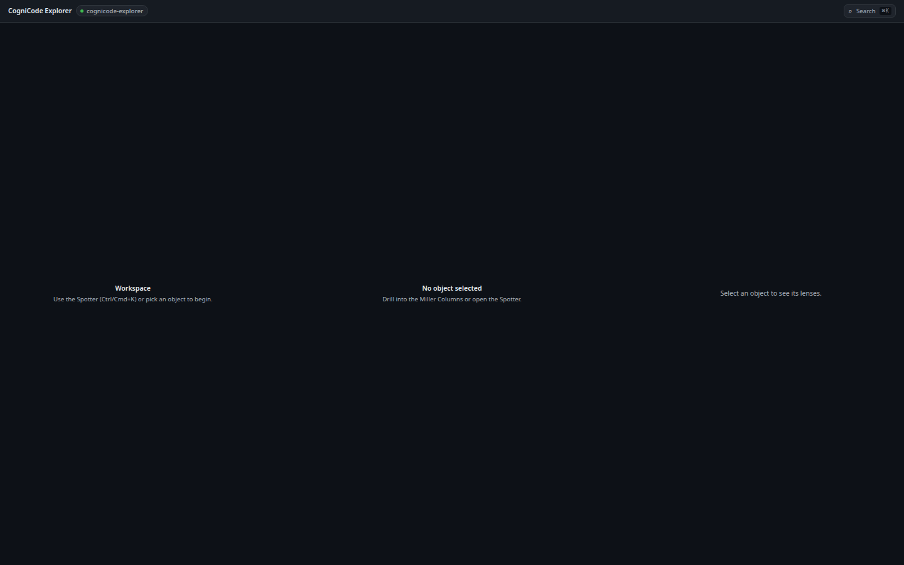

The header bar runs across the top of the application. It carries the product title, a live connection status indicator that shows whether the backend is reachable, and the Spotter trigger button (the keyboard shortcut hint `Cmd/Ctrl+K` is rendered next to it). The status bar at the bottom of the screen mirrors the same connection state, so you can always see whether you are looking at live data or mock fixtures.

## 2. Spotter Search

The Spotter is the fastest way to reach any object in the workspace. It is a command-palette style dialog that overlays the application and returns results as you type.

### 2.1 Opening the Spotter

Press `Cmd+K` (macOS) or `Ctrl+K` (Windows/Linux) from anywhere in the application, or click the search trigger in the header. The dialog opens with an empty input and a hint to start typing. You can also reach it via keyboard by pressing `Tab` until the search trigger is focused and then `Enter`.

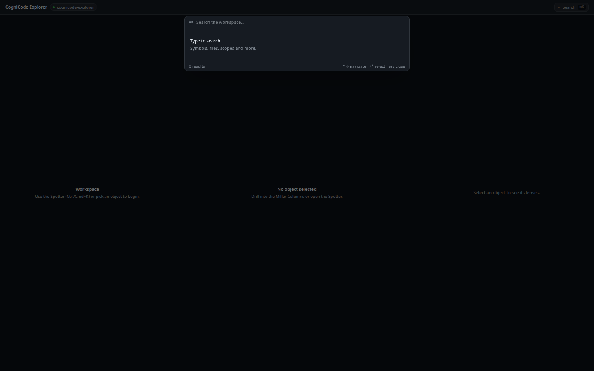

### 2.2 Searching for Objects

Type a query in the input. Results filter live across symbols, files, and scopes. Each row shows a kind icon (`ƒ` for functions, `S` for scopes, and similar markers for other kinds), the fully qualified name, the file path, and a saliency score on the right that ranks how relevant CogniCode considers the match.

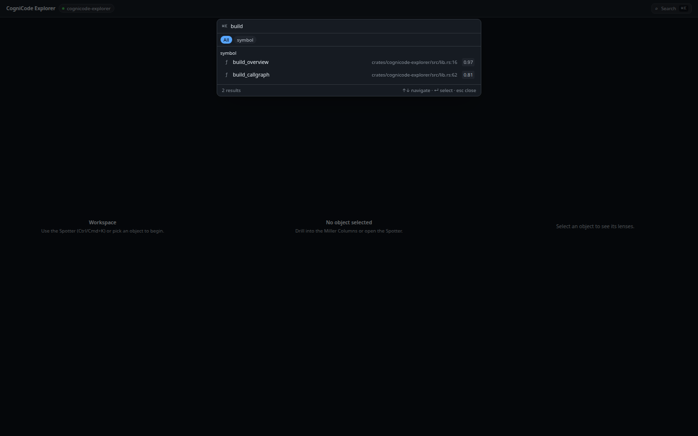

### 2.3 Filtering by Kind

A row of kind tabs sits above the result list. Click a tab to restrict results to a single symbol kind. The default `All` tab shows every match; the `symbol` tab narrows to function, class, method, and similar declarations. The currently active tab is highlighted.

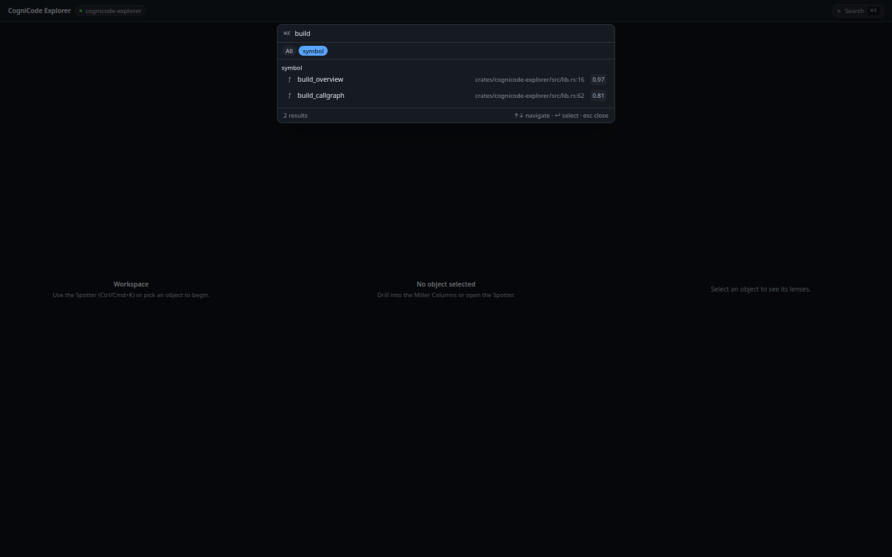

### 2.4 Selecting a Result

Use `Arrow Up` and `Arrow Down` to move the highlight, then press `Enter` (or click the row) to load the result. The Spotter closes, the Navigator and Inspector populate, and the Lens Panel becomes available. Press `Escape` or click outside the dialog to dismiss the Spotter without selecting.

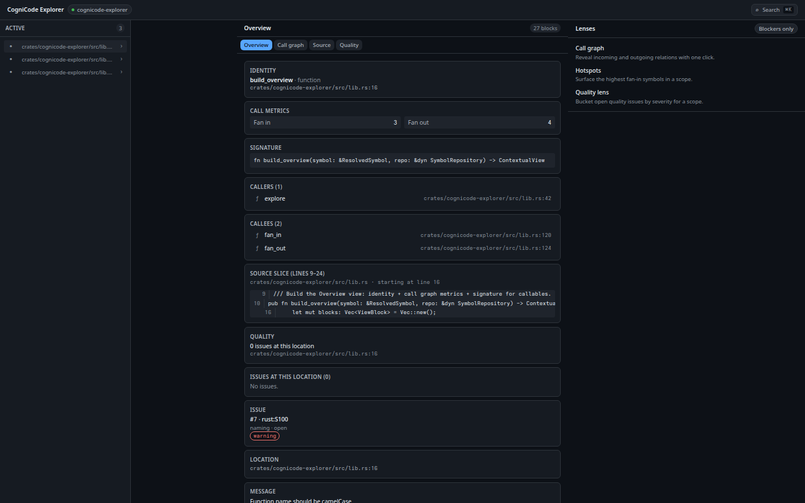

## 3. Miller Columns Navigator

The left panel implements Miller Columns navigation, a drill-down pattern familiar from file browsers. Each column represents one level of the hierarchy, and clicking an item opens the next level to its right. A breadcrumb above the columns reflects the current path.

### 3.1 How Drill-Down Works

Items that contain children display a `›` arrow on the right. Click the item (or press `Enter` when it has focus) to expand a child column. The breadcrumb updates immediately, and you can collapse back to a higher level by clicking any parent item in the breadcrumb or in an earlier column.

### 3.2 Two-Level Drill-Down

The first click on a scope opens the file column. From there you can see all source files contained in the selected scope, sorted by name. The newly opened column highlights the first item by default.

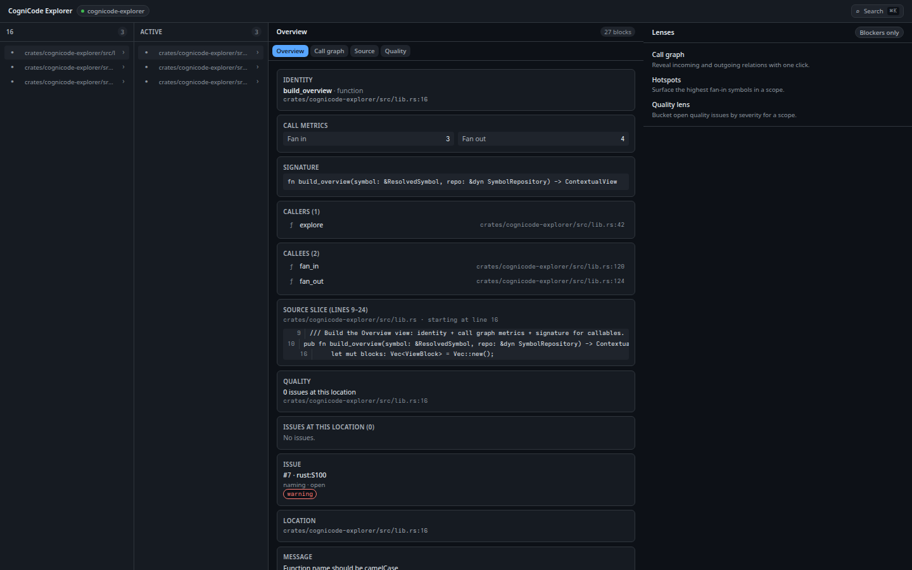

### 3.3 Three-Level Deep

A second click on a file opens the symbol column. The Navigator now shows three columns side by side: scope, file, and symbol. You can see every declaration and definition inside the selected file, with their kinds indicated by the leading icon.

### 3.4 Item Focus State

Clicked or keyboard-selected items receive a visible focus ring. The ring is a thin accent border that stays in place until focus moves elsewhere, and it gives you a clear indication of which item is currently the active selection. This focus indicator is also the cue the Object Inspector uses to know which object to render.

## 4. Object Inspector — Overview Tab

The center panel is the Object Inspector. It defaults to the **Overview** tab, which assembles every relevant fact about the selected object in a single scroll. The header strip shows the fully qualified name, the kind, the file path, and the line number.

### 4.1 Identity Block

The Identity block sits at the top of the Overview tab. It states the name, the kind (function, class, method, and so on), the file path, and the line number where the declaration lives. This is the canonical reference for "where is this thing defined".

### 4.2 Call Metrics + Signature

Directly below Identity, the Call Metrics block shows fan-in (how many places call this object) and fan-out (how many callees this object invokes). The Signature block follows, with the full function declaration including parameter types and the return type. Together they answer "how connected is this object and what does it look like".

### 4.3 Callers and Callees

Two compact lists enumerate the incoming callers and outgoing callees. Each entry is a clickable link that drives the Navigator to that symbol. If a caller lives in a different file or scope, the path is shown so you can tell at a glance whether a relation crosses a boundary.

### 4.4 Source Slice + Quality

Scrolling further down, the Source Slice block shows the relevant lines of source code inline. The Quality block beneath it lists any rules and smells detected on this specific object, with severity badges and a short description for each finding.

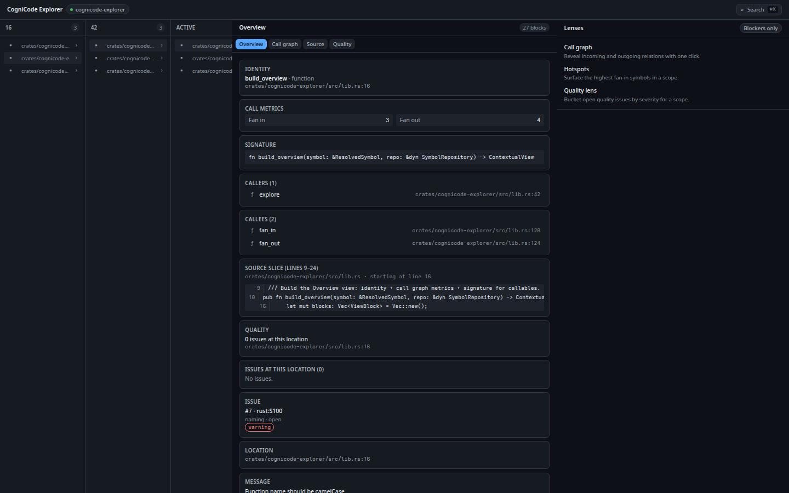

### 4.5 File and Scope Information

The Overview tab also surfaces the file the object lives in, with the file's line count, language, and total symbol count. A symbol kinds breakdown breaks the file down by declaration type. If you are inspecting a scope rather than a file, this section shows the scope's depth and child counts instead.

### 4.6 Cross-Scope Relations and Hotspots

The bottom of the Overview tab contains two more sections. The Cross-scope Relations table lists every call that crosses a scope boundary, sorted by saliency. The Top Hotspots list shows the highest fan-in symbols in the project — useful for identifying load-bearing code that deserves a careful look.

## 5. Object Inspector — Call Graph Tab

The Call Graph tab renders an interactive SVG visualization of the call relationships around the selected object. The selected object sits at the center; callers fan out to the left and callees to the right. Edges are directed arrows labeled with the call site.

You can pan the graph by dragging the background and zoom with the mouse wheel or trackpad. Each node is a clickable link that drives the Navigator to that symbol, so the graph works as a navigation surface as well as a visualization.

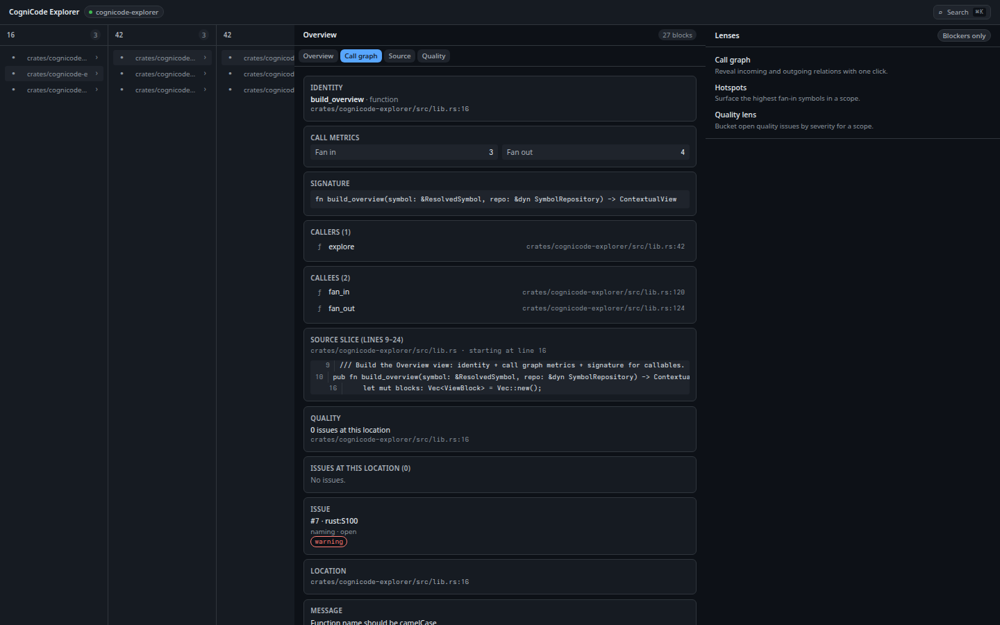

## 6. Object Inspector — Source Tab

The Source tab shows the full source of the file that contains the selected object, with line numbers in the gutter and syntax-aware highlighting. The declaration of the selected object is highlighted in the gutter and scrolled into view automatically on load.

Use this tab when you want to read code in context. The line numbers are clickable links: click any line to copy its reference, and click any other symbol name to jump to that symbol's Inspector.

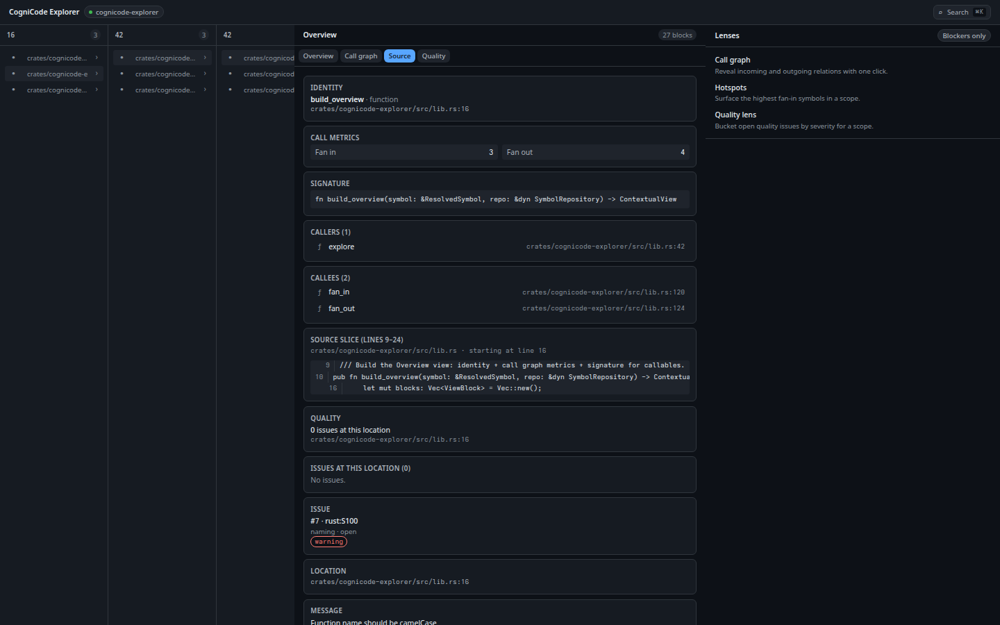

## 7. Object Inspector — Quality Tab

The Quality tab is a dashboard that summarizes the quality posture of the selected object and its containing file. It is the right place to look when you want to know "is this code healthy?".

The dashboard shows:

- A quality gate status with a clear pass or fail verdict, and the list of rules that caused a failure.
- Letter ratings (A through E) for maintainability, reliability, and complexity.
- Issues grouped by severity, from Blocker down to Info.
- A technical debt estimate in minutes, the time a developer would need to remediate every finding.

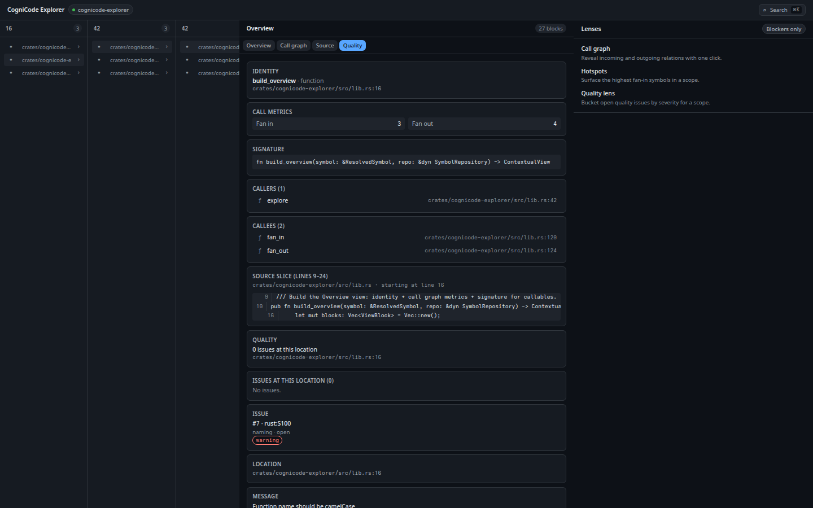

## 8. Lens Panel

The right panel is the Lens Panel. It is a contextual overlay that brings a single aspect of the selection to the foreground without crowding the Inspector. Each lens focuses on a different question you might ask about the selected object.

### 8.1 Available Lenses (Idle State)

In its idle state, the Lens Panel shows three buttons, one for each available lens: Call Graph, Hotspots, and Quality. Click any button to activate that lens. The previously active lens deactivates automatically.

### 8.2 Call Graph Lens

The Call Graph lens reveals the incoming and outgoing call relations of the current selection, ordered by saliency. It is a compact cousin of the Call Graph tab, optimized for at-a-glance use rather than full navigation.

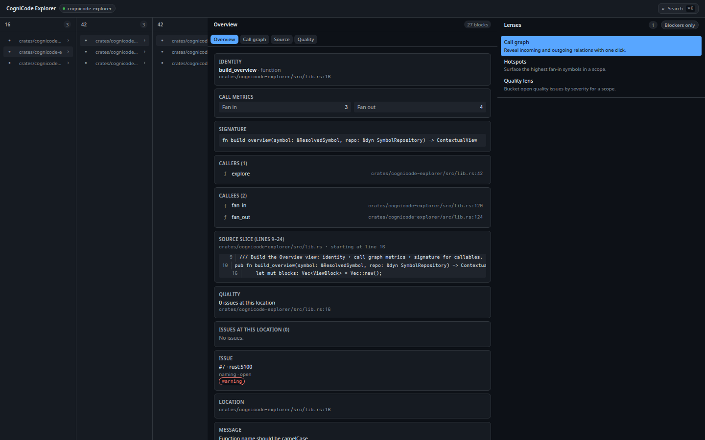

### 8.3 Hotspots Lens

The Hotspots lens surfaces the highest fan-in symbols in the project. Each entry carries a confidence score derived from the saliency model. This lens is the right place to look when you want to know "which parts of this codebase are doing the most work".

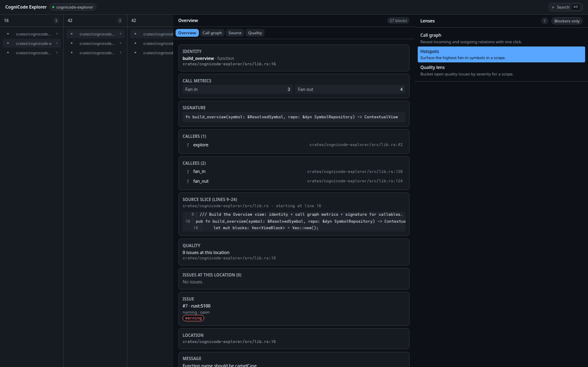

### 8.4 Quality Lens

The Quality lens buckets every quality issue affecting the current selection by severity: Blocker, Critical, Major (or Warning), Minor, and Info. Each entry is a clickable link to the affected object, so you can triage issues in one column and jump to the fix in another.

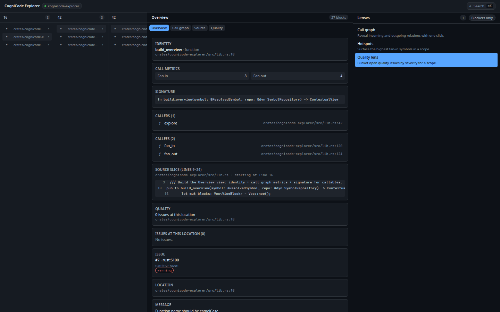

### 8.5 Blockers Only Toggle

A toggle at the top of the Lens Panel restricts the active lens to blocker-severity findings only. Switch it on when you want to focus exclusively on issues that gate a release. The toggle is sticky within the session: it stays on across lens changes until you switch it off.

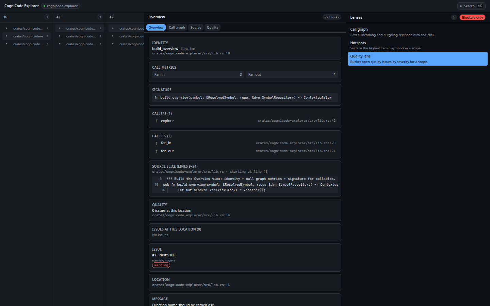

## 9. Responsive Design

The layout adapts to the available width. The interface was audited for keyboard accessibility at every breakpoint, and the dark theme is consistent across all sizes.

### 9.1 Mobile (390 px)

On a phone-sized viewport the three panels stack vertically. The Navigator collapses to a single column, and the Object Inspector and Lens Panel become full-width sections below it. You scroll through them in reading order, top to bottom.

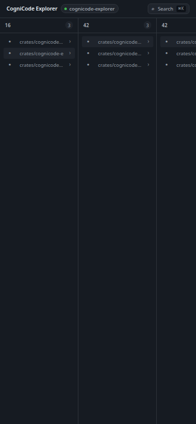

Scrolling down reveals the Object Inspector section in full width, with the Lens Panel following it. Touch scrolling works exactly like the desktop, and the Spotter still opens in a modal overlay.

### 9.2 Tablet (768 px)

On a tablet-sized viewport the layout becomes two columns. The Navigator and the Object Inspector share the top row, and the Lens Panel drops below them. This is a useful intermediate layout for code review on a lap or a stand.

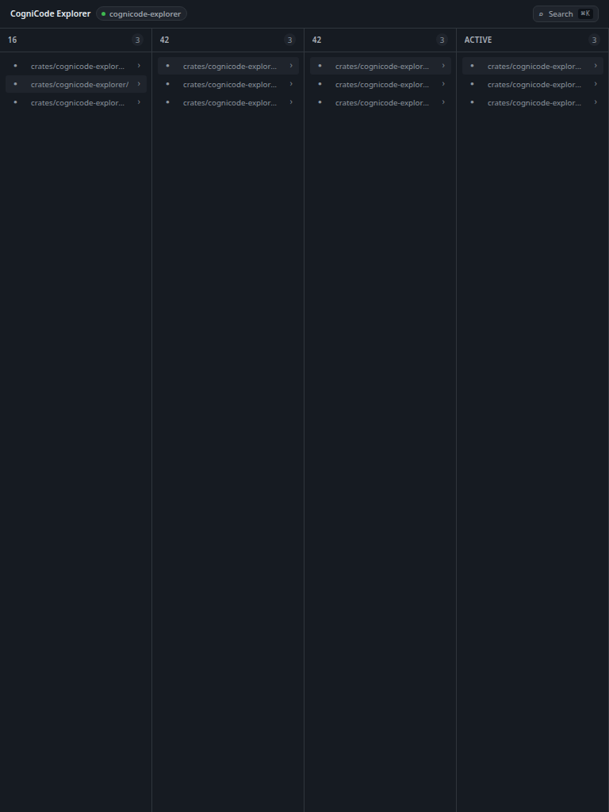

### 9.3 Desktop (1440 px+)

On a desktop monitor the canonical three-column layout is restored: Navigator on the left, Object Inspector in the center, Lens Panel on the right. All three are visible at the same time, which is the most efficient layout for navigating large codebases.

## 10. Keyboard Navigation

Every interactive element in the interface supports keyboard navigation. The application uses a roving tabindex pattern: `Tab` moves between structural regions (skip link, header buttons, columns, tabs, lens items), and `Arrow Up` and `Arrow Down` move the focus inside a region. This keeps the navigation predictable and avoids the cost of tabbing through dozens of items.

### 10.1 Skip-to-Content Link

The first focusable element is a skip-to-content link. Pressing `Tab` from the page load brings the link into focus with a visible ring. Press `Enter` to skip past the header and jump directly into the Navigator.

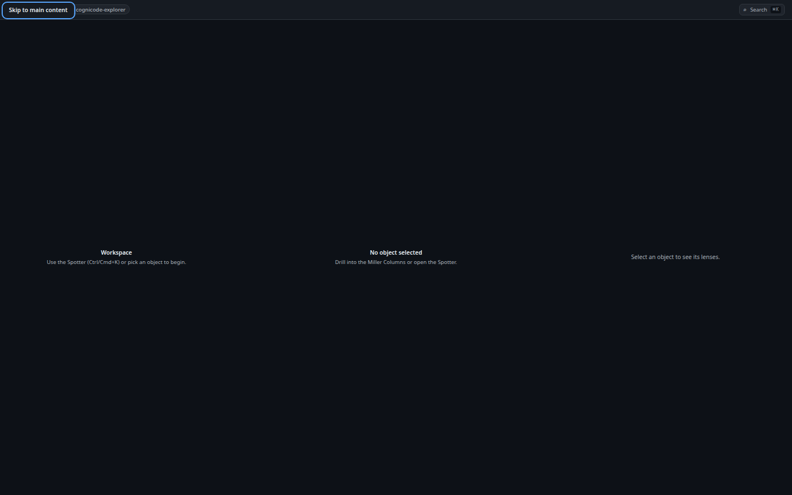

### 10.2 Spotter Trigger Focus

From the skip link, `Tab` moves focus to the Spotter trigger button in the header. The button shows a clear focus ring so you know exactly what will activate on `Enter`.

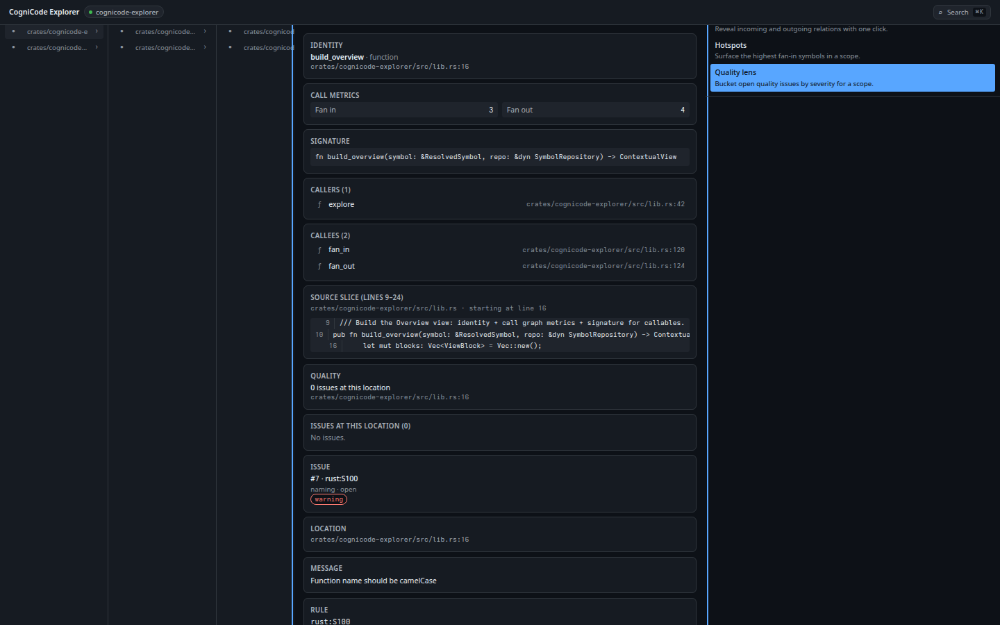

### 10.3 Spotter Input Focus

After opening the Spotter, the input field is auto-focused. The input carries a focus ring, and a subtle hint reminds you to start typing. All Spotter shortcuts (`Arrow Up/Down`, `Enter`, `Escape`) work from this state.

### 10.4 View Tab Focus

The four tabs in the Object Inspector (Overview, Call Graph, Source, Quality) are reachable by `Tab`. The active tab carries a focus ring distinct from its "active tab" styling, so you can see which tab has focus even when it is not the currently selected tab.

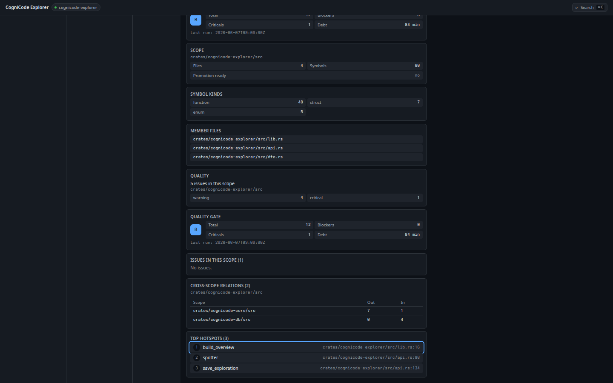

### 10.5 Lens Item Focus

Each item in the Lens Panel is reachable by `Tab` from the panel header. The active item carries a focus ring identical in style to the Miller Column focus ring, which keeps the visual language consistent across the application.

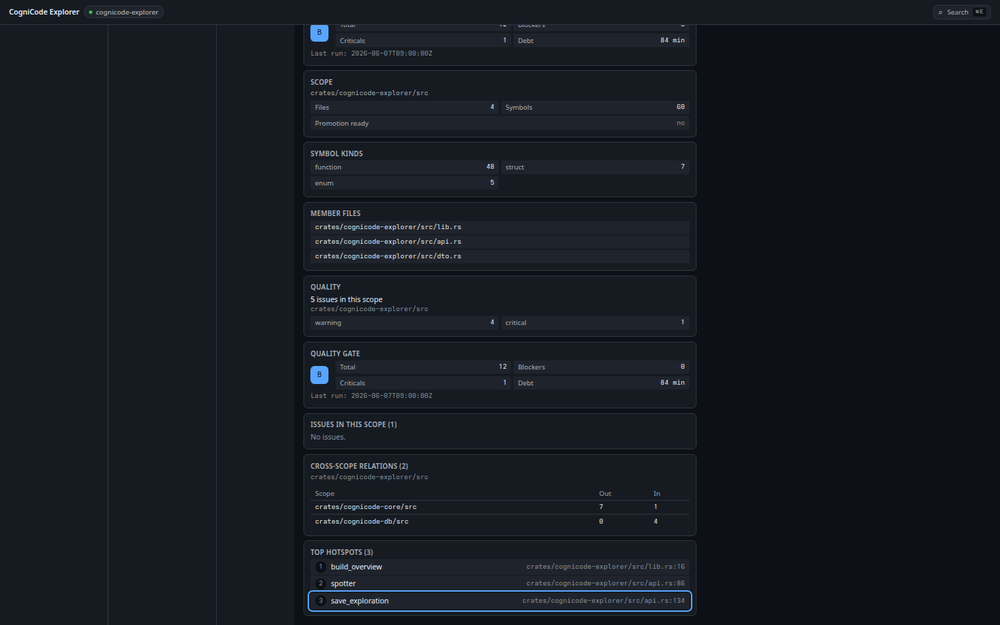

## 11. Keyboard Shortcuts

The full list of keyboard shortcuts:

| Shortcut | Action |
| --- | --- |
| `Cmd+K` / `Ctrl+K` | Open the Spotter |
| `Arrow Up` / `Arrow Down` | Navigate within the Spotter or Miller Columns |
| `Enter` | Select the highlighted item |
| `Escape` | Close the Spotter or dismiss a dialog |
| `Tab` | Move focus to the next panel or region |
| `Shift+Tab` | Move focus to the previous panel or region |

Both the Spotter and the Miller Columns implement the roving tabindex pattern, so `Tab` always moves between structural regions rather than between individual items. Inside a region, use `Arrow Up` and `Arrow Down` to move the active item.

## 12. Technology Stack

The application is built with the following stack:

- **React 19** with concurrent features for the Inspector and Lens.
- **TypeScript** in strict mode for end-to-end type safety.
- **Tailwind CSS 4** for the design system and dark theme.
- **Vite 6** as the build tool and dev server.
- **SWR** for data fetching, caching, and revalidation.
- **MSW (Mock Service Worker)** for the development mock backend used by `just explorer-dev`.
- **cmdk** for the Spotter command palette.
- **zod** for API schema validation.
- **Playwright** for end-to-end tests.

The production build is statically deployable; the only runtime dependency is a reachable `cognicode-explorer` backend or a compatible mock layer.
