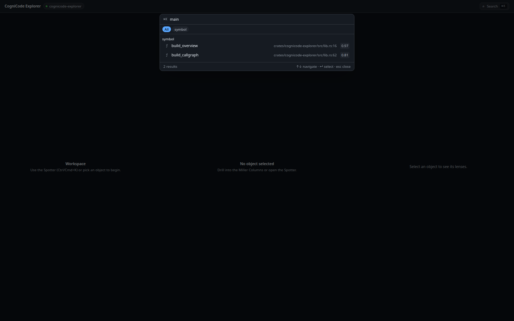
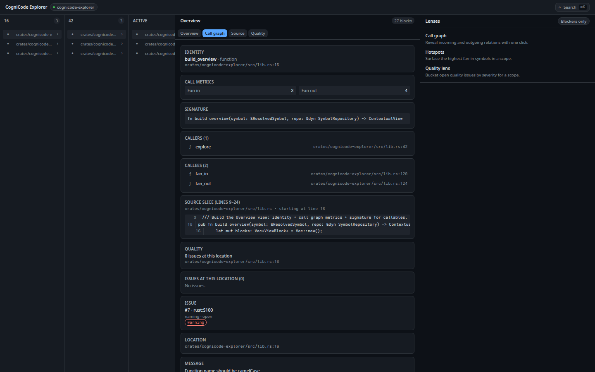
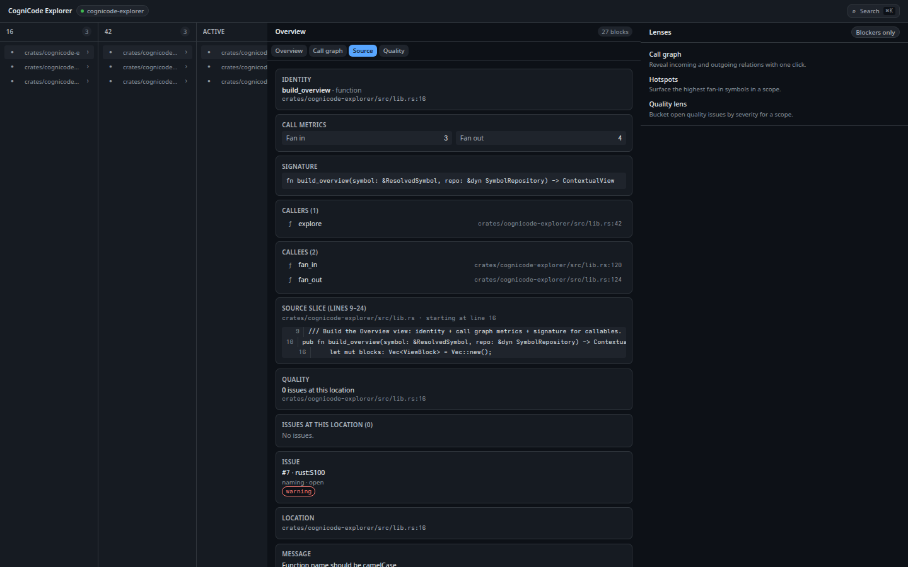
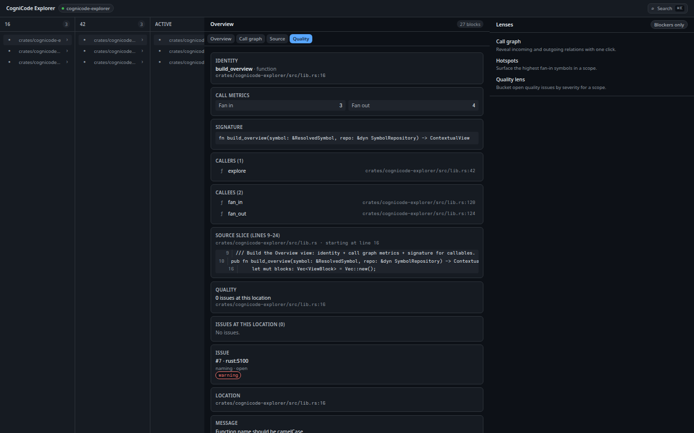
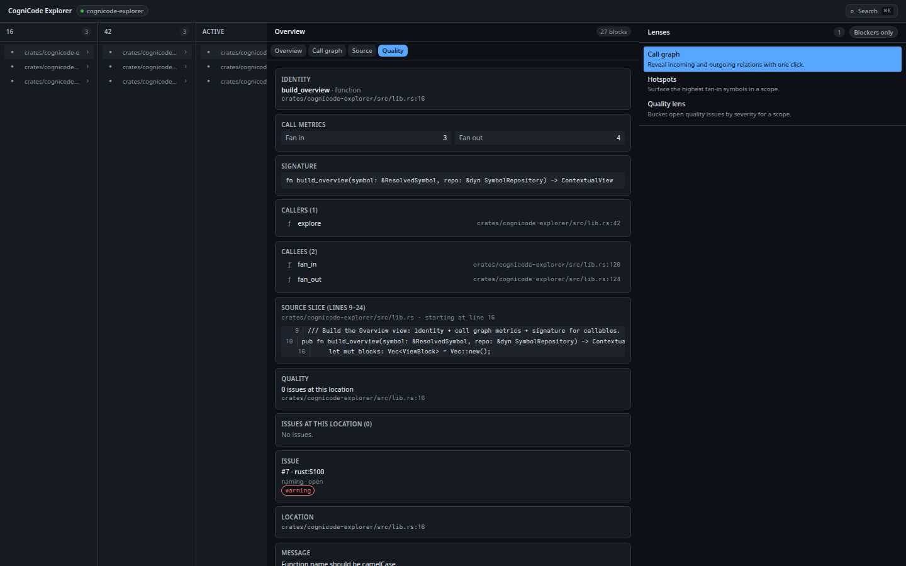
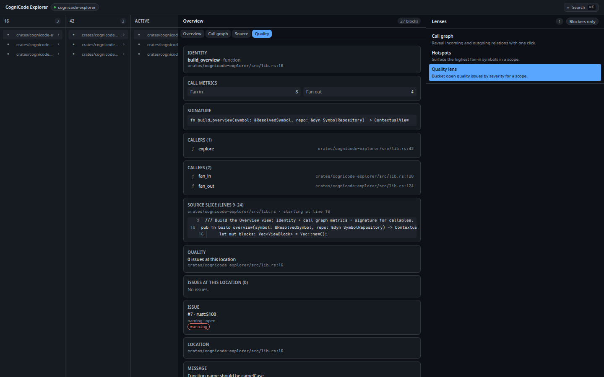
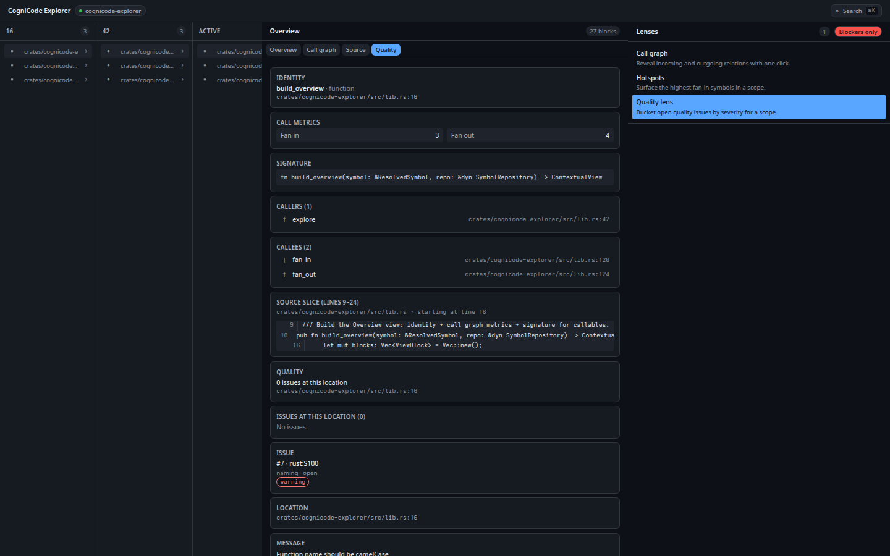
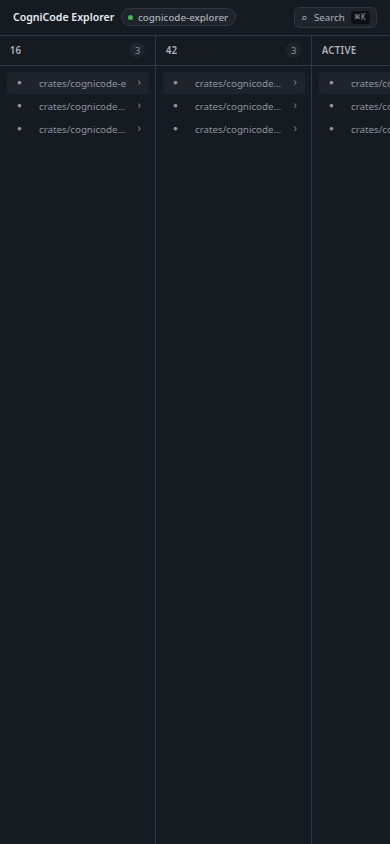
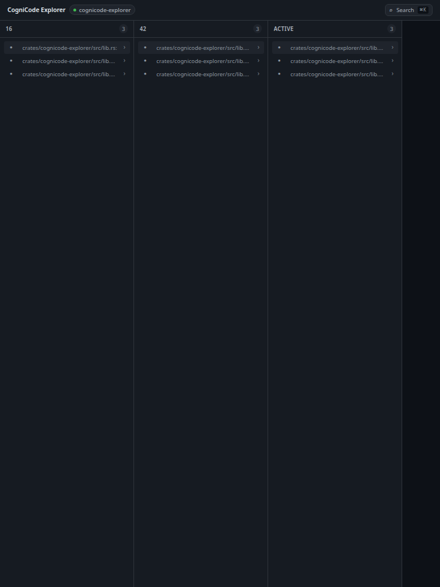

# CogniCode Explorer — User Manual

CogniCode Explorer is a single-page web application for navigating code intelligence data produced by the CogniCode analysis pipeline. It exposes a hierarchical view of scopes, files, and symbols, with on-demand details about callers, callees, source slices, call graphs, and code quality.

The application runs entirely in the browser and consumes read-only data from the cognicode-explorer backend. This manual describes the user interface, the navigation model, and the keyboard interactions.

## Quick Start

CogniCode Explorer is launched through the project `justfile`:

```bash
just explorer-dev
```

The command boots Vite on `http://127.0.0.1:5173/` and seeds the application with MSW (Mock Service Worker) fixtures, so the UI is fully usable without a live backend.

On first load you see three empty panels (Navigator, Inspector, Lens) and a Spotter button in the header. Press `Cmd+K` (macOS) or `Ctrl+K` (Windows/Linux) to open the Spotter and pick an entry point. The selected object populates the Navigator and Inspector.

## Interface Overview

The interface is a responsive three-panel layout. From left to right:

1. **Left panel — Miller Columns Navigator.** Hierarchical breadcrumb-style drill-down. Each column represents a level (Scope, File, Symbol). Items with a `›` arrow expand a child column on click.
2. **Center panel — Object Inspector.** Tabbed view of everything known about the selected object: identity, metrics, source, call graph, and quality.
3. **Right panel — Lens Panel.** A small contextual surface that highlights a single aspect of the selection (call relations, hotspots, or quality issues).

The application ships with a dark theme. All text, borders, and surfaces use a dark palette tuned for long reading sessions, and every interactive element has a visible focus ring for keyboard navigation. A status bar at the bottom indicates connection state to the backend.


## Spotter Search

The Spotter is the fastest way to reach any object. Open it with `Cmd+K` / `Ctrl+K`, or by clicking the search trigger in the header.

Behavior:

- **Type to search.** Results filter live across symbols, files, and scopes. Each result shows a kind icon (`ƒ` for functions, `S` for scopes, and similar markers for other kinds), the fully qualified name, the file path, and a saliency score.
- **Filter by kind.** Filter tabs above the result list let you restrict the query to a single symbol kind (function, class, method, etc.). The default tab shows all results.
- **Select a result.** Use `↑` and `↓` to move the highlight, then press `Enter` to load the object into the Navigator and Inspector.
- **Close without selecting.** Press `Escape` or click outside the dialog.

When the query has no matches, the dialog shows an empty state with a hint to refine the search.




## Miller Columns Navigator

The left panel implements Miller Columns navigation, a drill-down pattern used in file browsers and outline views. Each column represents one level of the hierarchy:

- **Scope column** — top-level containers (crates, modules, packages).
- **File column** — source files inside the selected scope.
- **Symbol column** — declarations and definitions inside the selected file.

Click any item with a `›` arrow to expand a child column to its right. The breadcrumb above the columns reflects the current path. To collapse, click a parent item or use the breadcrumb.

The Navigator uses a roving tabindex: `Tab` moves between columns, and `↑` / `↓` move the focus inside a column. This keeps keyboard navigation predictable and avoids the cost of tabbing through dozens of items.


## Object Inspector

The center panel shows everything known about the selected object. The header displays the fully qualified name, kind, and a one-line signature. Below the header, four tabs organize the detail views.

### Overview Tab

The default tab. It assembles the most relevant facts about the object in a single scroll:

- **Identity.** Fully qualified name, kind, visibility, location.
- **Call metrics.** Fan-in (number of callers) and fan-out (number of callees).
- **Signature.** Full declaration with parameter types and return type.
- **Callers.** Incoming call sites with file path and line number.
- **Callees.** Outgoing call sites with file path and line number.
- **Source slice.** The relevant lines of source code.
- **Quality issues.** Detected smells and rule violations affecting this object.
- **File info.** The containing file's size, language, and modification metadata.
- **Scope info.** The containing scope's name and depth.
- **Cross-scope relations.** Incoming and outgoing calls that cross scope boundaries.
- **Hotspots.** Whether this object appears in the top-fan-in list.

### Call Graph Tab

An interactive SVG graph that visualizes the call relationships around the selected object. The selected object sits at the center. Callers appear on the left, callees on the right. Edges are directed and labeled with the call site.

You can pan by dragging the background and zoom with the mouse wheel or trackpad. Each node is a clickable link to that symbol.



### Source Tab

The full source of the file that contains the object, with line numbers and syntax-aware highlighting. The declaration of the selected object is highlighted in the gutter and scrolled into view on load.



### Quality Tab

A quality dashboard for the selected object and its containing file:

- **Quality gate status.** Pass or fail, with the failing rules enumerated.
- **Ratings.** Letter grades (A through E) for maintainability, reliability, and complexity.
- **Issues by severity.** A list grouped by severity (Blocker, Critical, Major, Minor, Info).
- **Technical debt.** Estimated remediation time in minutes.



## Lens Panel

The right panel is a contextual overlay that brings a single aspect of the selection to the foreground. The available lenses are:

- **Call Graph lens.** Reveals incoming and outgoing call relations, ordered by saliency.
- **Hotspots lens.** Surfaces the highest fan-in symbols in the project, useful for finding load-bearing code.
- **Quality lens.** Buckets quality issues by severity, with one-click navigation to the affected object.

A **Blockers only** toggle at the top of the panel filters the active lens to show only blocker-severity issues. The toggle is sticky within the session.







## Responsive Design

The layout adapts to the available width:

- **Mobile (390 px and below).** Panels stack vertically. The Navigator collapses to a single column; the Inspector and Lens become full-width sections below.
- **Tablet (768 px).** Two-column layout. The Navigator and Inspector share the top row; the Lens drops below.
- **Desktop (1440 px and above).** The canonical three-column layout, all panels visible at once.

The interface was audited for keyboard accessibility at every breakpoint. The skip-to-content link, roving tabindex, and focus rings remain functional on touch devices when paired with an external keyboard.





## Keyboard Shortcuts

| Shortcut | Action |
| --- | --- |
| `Cmd+K` / `Ctrl+K` | Open the Spotter |
| `↑` / `↓` | Move highlight inside the Spotter or a Miller column |
| `Enter` | Select the highlighted item |
| `Escape` | Close the Spotter or dismiss a dialog |
| `Tab` | Move focus to the next panel or column |
| `Shift+Tab` | Move focus to the previous panel or column |

The Spotter and the Miller Columns both implement the roving tabindex pattern, so `Tab` always moves between structural regions rather than between individual items. Inside a region, use `↑` and `↓` to move the active item.

## Technology

The application is built with the following stack:

- **React 19** with concurrent features for the Inspector and Lens.
- **TypeScript** in strict mode for end-to-end type safety.
- **Tailwind CSS 4** for the design system and dark theme.
- **Vite 6** as the build tool and dev server.
- **SWR** for data fetching, caching, and revalidation.
- **MSW (Mock Service Worker)** for the development mock backend used by `npm run dev:mock`.

The production build is statically deployable; the only runtime dependency is a reachable cognicode-explorer backend or a compatible mock layer.
