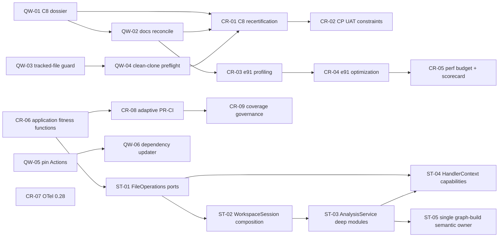
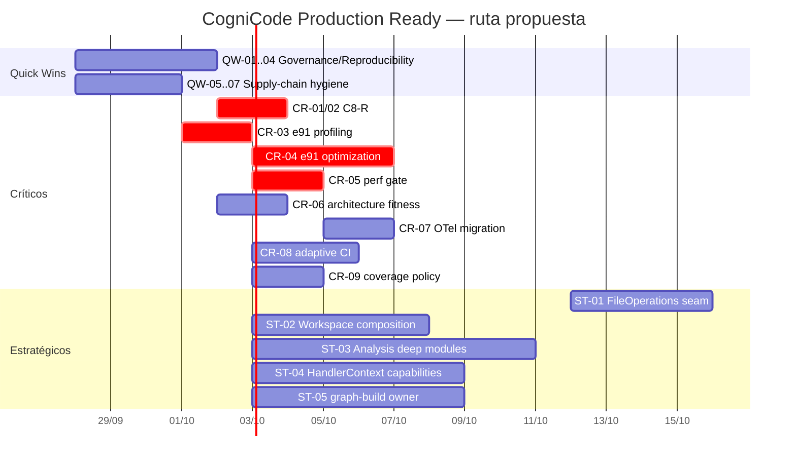

# Mapa de dependencias y cronograma

## Grafo de ejecución

## Timeline recomendado

Las fechas son orientativas y sirven para visualizar dependencias. El esfuerzo válido es el rango por acción; los días exactos deben recalibrarse tras CR-03 y tras el inventario inicial de CR-06.
