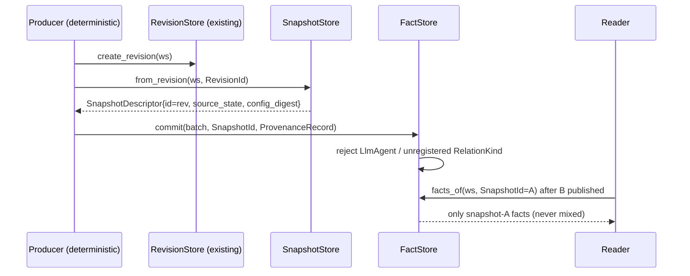

# Design: E36 LSI Evidence Kernel Foundation

> Delivery strategy: **auto-chain** — chained autonomous work-unit slices (WU-1..WU-4), each commit-ready with start/finish/verification/rollback. A1–A5 are resolved inputs, implemented here, not re-opened.

## Technical Approach

Additive-first strangler. M0 freezes graph/symbol/impact behavior via golden fixtures + benchmark baseline on existing sandbox scorecard infra (A2). M1 adds a kernel-namespaced evidence domain behind a new off-by-default `evidence-kernel` cargo feature (same `#[cfg]` pattern as `multimodal`), keeping the default build byte-identical. No store migration; Ladybug adapter deferred (D7).

## Architecture Decisions

| # | Decision | Alternatives | Rationale |
|---|----------|--------------|-----------|
| D1 | Kernel module `domain/evidence_kernel/{mod,ids,fact,evidence,snapshot,relation,ports}.rs`, cfg `evidence-kernel` | Scatter into `value_objects/`+`ports/` | One namespaced module gives A4 collision-freedom; `multimodal` is the established precedent |
| D2 | Kernel ports only in `evidence_kernel::ports`; legacy `ports::EvidenceStore` untouched, no cross re-exports | Rename legacy; re-export both | A4 extend-never-mutate; re-exports recreate the collision |
| D3 | `ProvenanceRecord{class: Provenance, producer, detail}` wraps legacy enum | New parallel enum | Legacy enum is bincode-format-sensitive; composition extends it untouched. `Fact::new` rejects `ProducerKind::LlmAgent` (ADR-040: LLM claims stay Hypothesis/AgentEvidence) |
| D4 | `SnapshotId(u64)` bijective with `RevisionId` per workspace; `SnapshotDescriptor{id, workspace, revision, source_state, config_digest}` via `SnapshotStore::from_revision` | Parallel snapshot timeline | A3/ADR-039 facade over revision model; `config_digest` holds extractor/pack versions so one revision may yield several descriptors later |
| D5 | Pinned reads: store methods take `(&WorkspaceId, &SnapshotId)`, return only that snapshot's facts | Untyped global reads | Makes snapshot mixing a testable contract violation |
| D6 | `SchemaRegistry` (sync) governs `RelationKind` vocabulary (`"ns:name"`); in-memory `FactStore` rejects unregistered predicates at commit | Async registry; no validation | Smallest defensible governance, no migration machinery |
| D7 | In-memory adapters in `infrastructure/evidence_kernel/`; Ladybug adapter deferred | Ladybug adapter now | No fact producer exists yet → dead SQL path, review bloat; ADR-028 pattern unchanged when it lands |
| D8 | M0 harness = `capture_lsi_fixtures.py` + `lsi_bench_baseline.py` reusing `release_scorecard.py` loaders and existing `graph_benchmarks` bench; fixtures reuse `sandbox/fixtures/*` micro-repos | Live-repo capture; new bench suite | A2; in-repo fixtures deterministic; bencher parse path proven by `perf-budget-check.sh` |

## Data Flow

```
sandbox/fixtures micro-repos ─► capture_lsi_fixtures.py (sorted keys/elements, scrubbed paths, no timestamps;
        │                       double-run byte check; --accept re-baseline; per-surface coverage)
        ▼
sandbox/fixtures/lsi-baseline/** goldens + inventory.json   (gates M1 code)
sandbox/results/lsi-baseline/baseline.json ◄─ lsi_bench_baseline.py ◄─ cargo bench --bench graph_benchmarks
        │ compare ─► per-benchmark delta ─► release_scorecard optional gate
        ▼ M0 green
Producer ─► SnapshotStore::from_revision ─► SnapshotDescriptor(rev→SnapshotId) ─► FactStore.commit(batch, SnapshotId)
Reader ─► FactStore.facts_of(ws, SnapshotId=A) ─► only-A facts
```



## File Changes

| File | Action | Description |
|------|--------|-------------|
| `crates/cognicode-core/src/domain/evidence_kernel/` (7 files) | Create | Kernel types + 4 ports, cfg `evidence-kernel` |
| `crates/cognicode-core/src/domain/mod.rs` | Modify | cfg-gated `pub mod evidence_kernel;` |
| `crates/cognicode-core/src/infrastructure/evidence_kernel/{mod,in_memory}.rs` | Create | In-memory stores + registry |
| `crates/cognicode-core/src/infrastructure/mod.rs`, `Cargo.toml` (core) | Modify | wiring + `evidence-kernel = []` feature |
| `sandbox/scripts/capture_lsi_fixtures.py` | Create | Deterministic capture, `--check`, `--accept`, coverage report |
| `sandbox/scripts/lsi_bench_baseline.py` | Create | Baseline capture + `compare` delta; reuses scorecard loaders |
| `sandbox/scripts/release_scorecard.py` | Modify | One optional gate row reading LSI baseline/delta |
| `sandbox/fixtures/lsi-baseline/**`, `sandbox/results/lsi-baseline/baseline.json` | Create | inventory + goldens; machine-readable baseline |
| `justfile` | Modify | `lsi-fixtures`, `lsi-baseline` recipes |

## Interfaces / Contracts

```rust
pub struct SnapshotId(pub u64); // bijective with RevisionId per workspace; Display "snap:N"
pub struct SnapshotDescriptor { pub id: SnapshotId, pub workspace: WorkspaceId,
    pub revision: RevisionId, pub source_state: String, pub config_digest: String }
pub struct ProvenanceRecord { pub class: Provenance /* legacy enum, never mutated */,
    pub producer: ProducerKind, pub detail: Option<String> }
pub enum ProducerKind { DeterministicAdapter, DeterministicAnalyzer, RuntimeObserver, LlmAgent, Human }
pub enum FactValue { Text(String), Int(i64), Float(f64), Bool(bool), Ref(EntityId) }
pub struct Fact { pub id: FactId, pub subject: EntityId, pub predicate: RelationKind,
    pub object: FactValue, pub snapshot: SnapshotId, pub provenance: ProvenanceRecord } // Fact::new rejects LlmAgent
pub struct Evidence { pub id: EvidenceId, pub fact: FactId,
    pub grade: EvidenceGrade /* Supports|Refutes|Corroborates */, pub provenance: ProvenanceRecord }

#[async_trait] pub trait FactStore: Send+Sync {
    async fn commit(&self, ws:&WorkspaceId, snap:&SnapshotId, batch: Vec<Fact>) -> Result<Vec<FactId>, KernelError>;
    async fn facts_of(&self, ws:&WorkspaceId, snap:&SnapshotId, subject:&EntityId) -> Result<Vec<Fact>, KernelError>; }
#[async_trait] pub trait EvidenceStore: Send+Sync { // kernel-namespaced (A4)
    async fn add(&self, ws:&WorkspaceId, e: Evidence) -> Result<EvidenceId, KernelError>;
    async fn for_fact(&self, ws:&WorkspaceId, snap:&SnapshotId, fact: FactId) -> Result<Vec<Evidence>, KernelError>; }
#[async_trait] pub trait SnapshotStore: Send+Sync {
    async fn from_revision(&self, ws:&WorkspaceId, rev: RevisionId) -> Result<SnapshotDescriptor, KernelError>;
    async fn descriptor(&self, ws:&WorkspaceId, id:&SnapshotId) -> Result<SnapshotDescriptor, KernelError>; }
pub trait SchemaRegistry: Send+Sync { // sync: in-process vocabulary, no I/O (QualityStore precedent)
    fn register(&self, k: RelationKind, s: RelationSpec) -> Result<(), SchemaError>;
    fn lookup(&self, k:&RelationKind) -> Option<RelationSpec>;
    fn list(&self) -> Vec<RelationSpec>; }
```

Baseline JSON: `{schema_version, commit, env{os,rustc,cargo}, benchmarks:[{name,mean_us,unit}]}`; `compare` emits per-benchmark `{name, baseline_mean_us, current_mean_us, delta_pct}`.

## Testing Strategy

| Layer | What | Command |
|-------|------|---------|
| Unit kernel types | `snap:N`↔`rev:N` mapping; exhaustive-variant FactValue/ProvenanceRecord round-trip (house pattern — no proptest in dev-deps); LlmAgent rejection; predicate validation | `cargo test -p cognicode-core --lib evidence_kernel --features evidence-kernel` |
| Unit adapters | In-memory round-trip; pinning (read pinned A after B exists → identical, zero B facts) | same filter (`infrastructure::evidence_kernel::…` matches) |
| M0 harness | Double-run byte-identity; diff without `--accept` fails; coverage report | `python3 sandbox/scripts/capture_lsi_fixtures.py --check`; baseline + `compare` |
| Guard | Default build unchanged; domain I/O-free | `cargo check -p cognicode-core` (± feature); `just lint` |

## Threat Matrix

| Boundary | Applicability |
|---|---|
| Shell/subprocess | Applicable (limited): capture/bench scripts spawn `cargo bench`/project CLI with fixed args, no `shell=True`, in-repo constant fixture roots, no user-supplied paths; failure = non-zero exit + report; silent overwrite forbidden (`--accept` required). Mapped checks = M0 byte-stability + re-baseline scenarios in `specs/lsi-m0-baseline/spec.md`; no product shell boundary → no extra product RED tests |
| Routing, git selection, commit/push state, PR commands, executable-file classification | N/A — no VCS/PR automation, routing change, or executable classification |

## Migration / Rollout

No data migration (no new persisted format). Feature off by default; runtime wiring is a gated no-op. Rollback: WU-1/2 delete scripts+artifacts, revert scorecard/justfile; WU-3/4 delete `evidence_kernel` modules + feature. Legacy paths untouched.

## Work-Unit Slices (auto-chain)

| WU | Scope | Finish / Verify | Rollback |
|----|-------|-----------------|----------|
| 1 M0 goldens | inventory.json + capture script + committed goldens | `--check` green twice + coverage report | delete script + `sandbox/fixtures/lsi-baseline/` |
| 2 M0 baseline | baseline.json + compare + scorecard/justfile wiring | `compare` emits delta report | revert 2 edits, delete script/results |
| 3 M1 types | `domain/evidence_kernel/` + feature + type tests | lib tests green; default `cargo check` unchanged | remove module + feature |
| 4 M1 stores | 4 ports + in-memory adapters + pinning tests | feature build + `just lint` green | same deletion |

## Open Questions

- [ ] Critical-surface weighting for the inventory — resolved during WU-1 `inventory.json` authoring; non-blocking.
- [ ] `source_state` format (git SHA vs content digest) — field reserved; may stay empty until semantic providers land.
