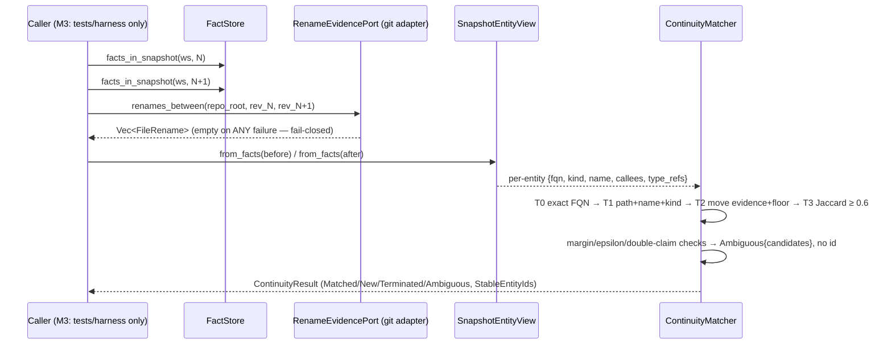

# Design: E38 LSI Stable Entity Identity

> Delivery strategy: **auto-chain** — chained work-unit slices WU-1..WU-5, stacked-to-main, no git commits without user approval. Resolved proposal assumptions A1–A4 are implemented here, not re-opened. Tree-entanglement ownership: e36+e37 are uncommitted on the same tree — e38 owns only NEW identity/continuity files plus strictly additive edits to e36-owned kernel files (`ids.rs`, `ports.rs`, `evidence_kernel/mod.rs`); e37's `PINNED_IDENTITY_DIGEST` (`fnv1a64:efccc22e912913fe`), goldens, and harness stay byte-untouched. Everything joins the existing off-by-default `evidence-kernel` feature.

## Technical Approach

Exploration Option B: the snapshot-scoped `EntityId` stays the occurrence key (facts, goldens, store schemas untouched); a new kernel-namespaced `continuity` module derives, per snapshot pair, `(ws, snap, EntityId) → (StableEntityId, status, evidence, confidence)` as a pure in-memory artifact. Inputs are the two `facts_in_snapshot` slices (ports.rs:89) plus resolved rename evidence passed as DATA. The matcher produces no facts → no `ProducerKind`/bincode impact. No continuity read port and no application service in M3 (assumption 4): tests drive store → matcher directly.

## Architecture Decisions

| # | Decision | Alternatives | Rationale |
|---|----------|--------------|-----------|
| D1 | Continuity lives in `domain/evidence_kernel/continuity/{mod,view,fingerprint,matcher}.rs` (cfg `evidence-kernel`). `StableEntityId` newtype added ADDITIVELY to `ids.rs` (Display `stable:N`, same derives as siblings); the unused `OccurrenceId` (ids.rs:50) is wired via const `from_entity(EntityId)`/`to_entity()` — an occurrence is the snapshot-scoped `EntityId` value. Output types `ContinuityResult`/`ContinuityOutcome`/`ContinuityStatus{Matched{tier,confidence},New,Terminated,Ambiguous{candidates}}`. | Own id file; application-layer continuity service | ids.rs is the declared kernel-id home (e36 D1 module map); assumption 4 forbids a read port/service in M3 — tests wire store→matcher directly |
| D2 | The matcher consumes rename evidence as DATA: `match_snapshots(before: &[Fact], after: &[Fact], renames: &[FileRename], thresholds: &MatcherThresholds) -> ContinuityResult`. The caller resolves `RenameEvidencePort` first. | Matcher takes `&dyn RenameEvidencePort` + repo/revs | Keeps the matcher pure and deterministic; fixture-declared evidence (fixtures are NOT git repos) injects identically to adapter output; the port exists for production wiring at cutover |
| D3 | Tier pipeline over per-snapshot entity views: **view recovery** — facts carry only `EntityId`, so `SnapshotEntityView::from_facts` recovers each symbol's FQN from its `core:defines` fact OBJECT (the fact grammar stores the entity's own FQN there, tree_sitter_facts.rs:41-51) and kind from that fact's `provenance.detail` `kind=<K>`; callees/type-refs from the subject's `core:calls`/`core:references` objects. **Tiers**: T0 identity string present in both → T1 same path+name+kind → T2 file-move evidence + equal (kind,name) → T3 fingerprint Jaccard ≥ threshold (kind hard pre-filter). Entities = `core:defines` subjects only (files are evidence input, not tracked entities). **Ambiguity (fail-closed, ADR-038)**: >1 candidate at T1/T2, T3 scores tied within epsilon, or one after-entity double-claimed by two before-entities at the same tier → `Ambiguous{candidates}` with NO `StableEntityId`. Candidate ordering (score desc, name-equal, FQN asc) only enumerates deterministically — it never rescues a within-epsilon tie. **Terminated** = before-only (stable id retained); **New** = after-only, fresh `StableEntityId(K+1..)` in sorted FQN order after the before-pool max. **No-resurrection** (A1): matching is strictly pairwise N→N+1 with no history table, so a symbol reintroduced later gets a NEW stable id; **Ambiguous is terminal per pair** (A2), never backfilled. Facts are sorted inside the view (commit order in, canonical order out). | Global assignment across all snapshots; greedy order-dependent processing; tie-break picks a winner | Spec requires matcher sorts itself + identical mappings regardless of commit order; ADR-038 forbids forcing ambiguous matches |
| D4 | Fingerprint v1 = ONE tagged multiset: `{"name:<name>"}` ∪ `{"call:<callee>"...}` ∪ `{"ref:<type>"...}` (sorted `BTreeMap<String, usize>`), computed by a pure function from one subject's facts — no extractor change. `similarity(a,b)` = 0.0 unless `kind` equal, else multiset Jaccard (harness.rs:435 discipline) over the tagged elements. A rename therefore costs exactly the two `name:` elements (body-dominated), and colliding candidates score equal → epsilon catches them. Entities with no calls/refs score 0 and are never T3-matched (fail-closed). | `(kind,name)` strict equality core (rename can never match); averaging name into the score (pure rename ≈ 0.5, below any sane threshold); body-hash fingerprint (extractor change, touches e36 goldens) | Single deterministic score covers rename AND collision; the "kind-and-name core" rides as tagged elements per the spec wording; known Rust-import gap is harmless (calls/refs unaffected) |
| D5 | `RenameEvidencePort` (SYNC, `Send + Sync`) added additively to kernel `ports.rs` (e36 D2 namespacing; sync-port precedent = `SchemaRegistry`). Adapter `infrastructure/git/rename_evidence.rs` runs `git diff --name-status --find-renames=50% <before> <after>` via `git -C <repo_root>` (std::process::Command, `.arg()` composition, git_history.rs:23-28 precedent), parses `R<nnn>\t<old>\t<new>` rows → `FileRename{old_path, new_path, similarity: nnn/100}`. ANY failure — git absent, non-repo dir, non-zero exit, unborn/unknown rev, unparseable row — degrades to an EMPTY Vec + `tracing::warn`: no evidence, never invented evidence, tiers fall through. | `git2` crate (no workspace dependency exists); `--name-status` without `-z` skipping bad rows (hides garbage) | Spec "Fail-closed rename evidence port"; exploration confirms no `git2` anywhere; strict parse degrades to empty rather than partial evidence |
| D6 | Thresholds are pinned constants in `matcher.rs`: `MatcherThresholds { jaccard_match_threshold: 0.6, ambiguity_epsilon: 0.05, rename_similarity_floor: 0.5 }` (T2 requires git similarity ≥ floor). A `MATCHER_CONVENTION` text (tier order + fingerprint composition + constant values) is hashed FNV-1a 64 into `PINNED_MATCHER_DIGEST` — a digest SEPARATE from e37's `PINNED_IDENTITY_DIGEST` (harness.rs:85-91 pattern). Changing any constant or convention text fails the run until explicitly re-pinned. | Config-file thresholds (runtime drift); reusing e37's digest (couples unrelated conventions) | Resolved assumption 3; spec "Separate pinned convention digest"; re-pin duty explicit |
| D7 | Benchmark harness mirrors e37 D7: `tests/identity_benchmark.rs` + `tests/identity_benchmark/harness.rs` (file-level `#![cfg(feature = "evidence-kernel")]`). Gates declared before scoring: `PRECISION_THRESHOLD=0.95`, `RECALL_THRESHOLD=0.90`, `LINE_SHIFT_RETENTION=1.00`, `MOVE_RETENTION=0.99`. Seven fixture cases under `sandbox/fixtures/lsi-identity/<case>/{before/,after/,evidence.json,expected-mapping.json}` (see Data Flow); fixtures are NOT git repos (lsi-baseline precedent) — T2 evidence is declared in `evidence.json`, while the git adapter is tested on throwaway `git init` repos. Scoring: precision/recall over Matched-vs-expected multiset per case; `Ambiguous` counts as NEITHER match nor miss and is reported separately (quarantine pattern); a case expecting `Ambiguous` that returns any other status FAILS the run (inverted fail-closed check). Recipe `just lsi-identity`, fixed argv. | Reusing lsi-baseline fixtures (no before/after pairs); counting ambiguous as miss | state.yaml M3 exit gates; spec REQ-1/REQ-2 of identity-benchmark; e37 quarantine precedent |
| D8 | **No bench — N/A.** The matcher is exercised only by tests at fixture scale (tens of entities per pair) and has no production consumer in M3. A criterion bench would create a new sub-µs noise surface (e37 verify WARNING 1 precedent: perf gate still unadjudicated) with no load-bearing signal. Revisit at consumer cutover. | Advisory bench following e37 D8 | Honest N/A: nothing measurable is load-bearing yet; e37's warning shows the cost of premature micro-benches |

## Data Flow

```
sandbox/fixtures/lsi-identity/<case>/{before,after}  (7 cases: pure-rename, rename-edit,
        │                                             move, move-edit, line-shift,
        │                                             colliding-names, control)
        ▼
extract_file → FactBatchBuilder::finish (e37 D3, untouched) → InMemoryFactStore::commit(ws, N) / (ws, N+1)
        │
        ▼
facts_in_snapshot(ws, N), facts_in_snapshot(ws, N+1) ──► SnapshotEntityView::from_facts (sorts, recovers FQN/kind/callees)
        │                                                            │
git diff -C repo (adapter, optional) ─► Vec<FileRename> ─────────────┤
        │                                                            ▼
        └────────────────────────────► ContinuityMatcher::match_snapshots
                                        T0 → T1 → T2 → T3, margin/epsilon → Ambiguous
                                                     │
                                                     ▼
                            ContinuityResult: outcomes (Matched{tier,confidence} | New | Ambiguous)
                                              + terminated; StableEntityId 1..K inherited, K+1.. fresh
```



`expected-mapping.json` (per case): `{"schema_version":1, "case":"pure-rename", "entities":[{"before":"src/lib.rs:foo:3"|"null", "after":"src/lib.rs:bar:3"|"null", "status":"Matched|New|Terminated|Ambiguous", "tier":"ExactIdentity|PathNameKind|RenameEvidence|Fingerprint" (optional), "candidates":["..."] (required iff Ambiguous)}]}`. `evidence.json`: `[{"old_path","new_path","similarity"}]` (T2 cases only).

## File Changes

| File | Action | Description |
|------|--------|-------------|
| `crates/cognicode-core/src/domain/evidence_kernel/ids.rs` | Modify (additive, e36-owned) | `StableEntityId` newtype + Display `stable:N`; `OccurrenceId::from_entity`/`to_entity` const wiring |
| `crates/cognicode-core/src/domain/evidence_kernel/continuity/{mod,view,fingerprint,matcher}.rs` | Create | View recovery, fingerprint v1, tiered matcher + pinned thresholds (cfg `evidence-kernel`) |
| `crates/cognicode-core/src/domain/evidence_kernel/mod.rs` | Modify (additive) | `pub mod continuity;` + re-exports (e36-owned file; e37 edited it the same way) |
| `crates/cognicode-core/src/domain/evidence_kernel/ports.rs` | Modify (additive, e36-owned) | `FileRename` + sync `RenameEvidencePort` (fail-closed contract in docs) |
| `crates/cognicode-core/src/infrastructure/git/rename_evidence.rs` | Create | `GitRenameEvidenceAdapter` shell-out (git_history.rs pattern) |
| `crates/cognicode-core/src/infrastructure/git/mod.rs` | Modify (additive) | cfg-gated `pub mod rename_evidence;` |
| `crates/cognicode-core/tests/workspace_isolation.rs` | Create | collisions = 0 suite (two workspaces, identical symbol sets) |
| `crates/cognicode-core/tests/identity_benchmark.rs` + `tests/identity_benchmark/harness.rs` | Create | Gates, scoring, `MATCHER_CONVENTION` + `PINNED_MATCHER_DIGEST`, quarantine |
| `sandbox/fixtures/lsi-identity/<7 cases>/{before,after,evidence.json,expected-mapping.json}` | Create | Ground-truth fixtures (not git repos) |
| `justfile` | Modify | `lsi-identity` recipe (fixed argv; e36/e37 own the other `lsi-*` recipes) |

Honest no-op: `application/fact_bridge/` needs NO edit (the matcher recovers everything from facts; no production consumer exists) — recorded per the e37 deviation-a precedent, despite the proposal's "additive wiring" row.

## Interfaces / Contracts

```rust
// ids.rs — ADDITIVE
pub struct StableEntityId(pub u64);                    // Display "stable:N", Copy/Eq/Hash/Ord/Serde
impl OccurrenceId { pub const fn from_entity(e: EntityId) -> Self; pub const fn to_entity(self) -> EntityId; }

// ports.rs — ADDITIVE (sync; fail-closed: empty Vec on any failure)
pub struct FileRename { pub old_path: String, pub new_path: String, pub similarity: f64 }
pub trait RenameEvidencePort: Send + Sync {
    fn renames_between(&self, repo_root: &Path, before_rev: &str, after_rev: &str) -> Vec<FileRename>;
}

// continuity/view.rs
pub struct EntityFacts { pub entity: EntityId, pub fqn: String, pub kind: String,
    pub name: String, pub callees: Vec<String>, pub type_refs: Vec<String> }
pub struct SnapshotEntityView { pub snapshot: SnapshotId, pub entities: BTreeMap<EntityId, EntityFacts> }
impl SnapshotEntityView { pub fn from_facts(facts: &[Fact], snapshot: SnapshotId) -> Self; } // sorts facts itself

// continuity/fingerprint.rs
pub struct SemanticFingerprint { pub kind: String, pub name: String, pub elements: BTreeMap<String, usize> }
pub fn fingerprint(e: &EntityFacts) -> SemanticFingerprint;              // tagged multiset, pure
pub fn similarity(a: &SemanticFingerprint, b: &SemanticFingerprint) -> f64; // 0.0 unless kind equal; else multiset Jaccard

// continuity/matcher.rs
pub struct MatcherThresholds { pub jaccard_match_threshold: f64,   // 0.6 pinned
    pub ambiguity_epsilon: f64, pub rename_similarity_floor: f64 } // 0.05 / 0.5 pinned
pub enum MatchTier { ExactIdentity, PathNameKind,
    RenameEvidence { old_path: String, new_path: String, similarity: f64 }, Fingerprint { score: f64 } }
pub enum ContinuityStatus { Matched { tier: MatchTier, confidence: f64 }, New, Terminated,
    Ambiguous { candidates: Vec<String> } }
pub struct ContinuityOutcome { pub fqn: String, pub occurrence: OccurrenceId,
    pub snapshot: SnapshotId, pub stable_id: Option<StableEntityId>, pub status: ContinuityStatus } // None ONLY for Ambiguous
pub struct ContinuityResult { pub outcomes: Vec<ContinuityOutcome> } // sorted by (snapshot, fqn)
pub fn match_snapshots(before: &[Fact], after: &[Fact], renames: &[FileRename],
    thresholds: &MatcherThresholds) -> ContinuityResult;
```

## Testing Strategy

| Layer | What | Command |
|-------|------|---------|
| Unit continuity | View recovery (FQN from defines object, kind from detail, callee/ref multisets); fingerprint fact-determinism (spec scenario); tier mechanics; epsilon/margin ambiguity; double-claim; Terminated/New id assignment; no-resurrection; identical mappings under fact permutation | `cargo test -p cognicode-core --lib continuity --features evidence-kernel` |
| Unit ids | `StableEntityId` display/serde/copy; `OccurrenceId` wiring | `cargo test -p cognicode-core --lib evidence_kernel --features evidence-kernel` |
| Unit git adapter | `R<nnn>` row parsing; fail-closed: git absent (PATH override), non-repo dir, unborn rev, malformed output → empty; happy path on throwaway `git init` repos (tempfile) | `cargo test -p cognicode-core --lib rename_evidence --features evidence-kernel` |
| Integration isolation | Two workspaces committing identical sets: per-snapshot EntityId tables equal, no mapping/candidate crosses workspaces, ws-a result invariant across ws-b run; `collision_count == 0` | `cargo test -p cognicode-core --test workspace_isolation --features evidence-kernel` |
| Integration benchmark | All gates; missed gate fails naming gate+value; ambiguous case quarantined and reported separately; expected-Ambiguous returning Matched fails; digest pin + re-pin error text | `just lsi-identity` |
| Guard | e37 evidence fresh: `just lsi-equivalence` green with `PINNED_IDENTITY_DIGEST` unchanged; `just lsi-fixtures check` byte-stable; gate-off compiles 0 tests; fmt; clippy zero findings on new code (pre-existing macros/generic_graph red is known) | `cargo check -p cognicode-core` ± `--features evidence-kernel`; `cargo clippy -p cognicode-core --lib --tests --features evidence-kernel` |
| UAT | U20/U21/U22 formal runs deferred, reported honestly (A5 / e37 precedent) | `docs/CogniCode_Living_Software_Intelligence/docs/uat/` |

## Threat Matrix

| Boundary | Applicability | Design response | Planned RED tests |
|---|---|---|---|
| Shell/subprocess | **Applicable** — the git adapter spawns `git` | Fixed argv via `std::process::Command` `.arg()` (no shell, no string interpolation); output is parsed, never executed; revs come from the caller as opaque strings | git absent from PATH → empty evidence; malformed row → empty evidence |
| Documentation-like paths | N/A — no executable-file classification; diff output paths are data | — | — |
| Git repository selection | **Applicable** — `git -C` authority | Adapter runs `git -C <repo_root>` with the caller-supplied root; non-repo dirs degrade to empty evidence | non-repo directory → empty evidence |
| Commit state | Applicable (limited) — two explicit revs diffed | Index/worktree never consulted; unborn HEAD / unknown rev → non-zero exit → empty evidence | empty `git init` repo (no commits) → empty evidence |
| Push state | N/A — no push, refspec, or remote interaction | — | — |
| PR commands | N/A — no PR automation | — | — |

## Migration / Rollout

No data migration (continuity output is derived in-memory; no persisted format; snapshot `EntityId` remains the occurrence key — ADR-038 rollback stance). Feature off by default; no runtime wiring. Rollback per WU table: delete new files, revert the three additive e36-file edits + justfile line. Facts, goldens, `PINNED_IDENTITY_DIGEST`, and store schemas are untouched.

## Work-Unit Slices (auto-chain)

| WU | Scope | Finish / Verify | Rollback |
|----|-------|-----------------|----------|
| 1 Continuity types + view + fingerprint | `ids.rs` additive (`StableEntityId`, `OccurrenceId` wiring); `continuity/{mod,view,fingerprint}.rs` + recovery/determinism tests | lib `continuity`+`evidence_kernel` tests green; default `cargo check` unchanged | revert `ids.rs` edits; delete `continuity/` + mod.rs line |
| 2 Rename-evidence port + adapter | `ports.rs` additive; `infrastructure/git/rename_evidence.rs` + git/mod.rs wiring; parse + fail-closed tests on throwaway repos | adapter tests green incl. git-absent/non-repo/unborn-rev; scoped clippy clean | revert `ports.rs` + git/mod.rs; delete adapter |
| 3 Tiered matcher | `continuity/matcher.rs` (T0–T3, thresholds, statuses, ambiguity, double-claim, Terminated/New) + determinism tests (permutation-invariant mappings) | matcher tests green; identical `ContinuityResult` under shuffled input; scoped clippy clean | delete `matcher.rs` |
| 4 Isolation + fixtures + benchmark + recipe | `tests/workspace_isolation.rs`; `sandbox/fixtures/lsi-identity/` 7 cases; `tests/identity_benchmark{.rs,/harness.rs}`; `justfile lsi-identity` | `just lsi-identity` green (gates met, digest pinned, ambiguous quarantined); isolation collisions = 0 | delete test files + fixtures; revert justfile |
| 5 Guards + handoff | both feature-state checks; fmt; clippy zero on new paths; e37 evidence-reuse check (`just lsi-equivalence`, `just lsi-fixtures check`, digest unchanged); `.agent/TESTING-STATE.md` handoff | all green; handoff recorded | n/a (verification-only) |

## Open Questions

- [ ] Nominal threshold values (0.6 / 0.05 / 0.5) are confirmed during WU-3/4 fixture tuning; any change re-pins `PINNED_MATCHER_DIGEST` explicitly (non-blocking by design).
- [ ] Same-file overloads (same path+name+kind, different lines) that all shift lines resolve to `Ambiguous` in v1 — accepted fail-closed; order-aware disambiguation deferred.
- [ ] UAT-U20/U21/U22 formal runs deferred with honest reporting (A5), matching the e37 verify precedent.
