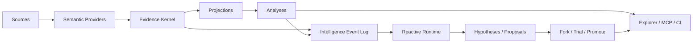
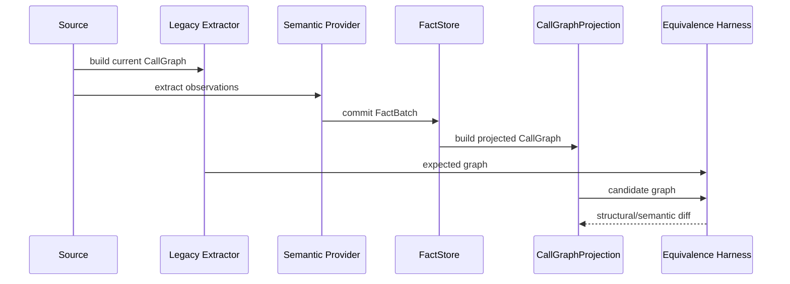
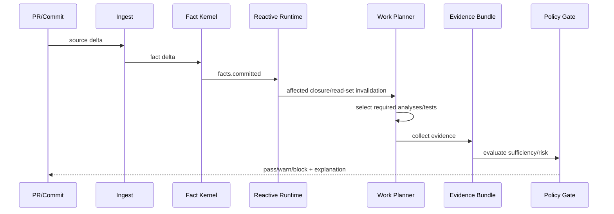

# Design: Living Software Intelligence Foundation

## Architecture

## Core decisions

1. Facts are canonical; graphs are projections.
2. Entity identity is separate from source occurrence.
3. Snapshot pins source+analysis configuration.
4. LLM outputs are hypotheses/proposals.
5. Read dependencies are lineage.
6. Reactive work is bounded and policy-controlled.
7. Software worlds provide isolated experimentation.

## Projection migration sequence

## Reactive CI sequence

## Data authority

| Producer | Can write Fact | Can write Evidence | Can write Hypothesis | Can write ChangeProposal |
|---|---:|---:|---:|---:|
| Tree-sitter adapter | yes | yes | no | no |
| LSP/compiler adapter | yes | yes | no | no |
| deterministic analyzer | derived facts | yes | no | no |
| runtime/test adapter | observed facts | yes | no | no |
| LLM agent | no | agent evidence | yes | yes |
| human | manual fact through explicit workflow | yes | yes | yes |

## Storage

LadybugDB remains the default graph-oriented persistence adapter. The domain contract SHALL remain backend-neutral. Content-addressed batch storage MAY use a separate physical representation if benchmarks show material benefit.

## Incremental computation

Phase 1 uses explicit dependency/read sets and cached summaries. Differential Dataflow is a later optimization gated by SPIKE-011; it SHALL NOT drive Fact semantics.
